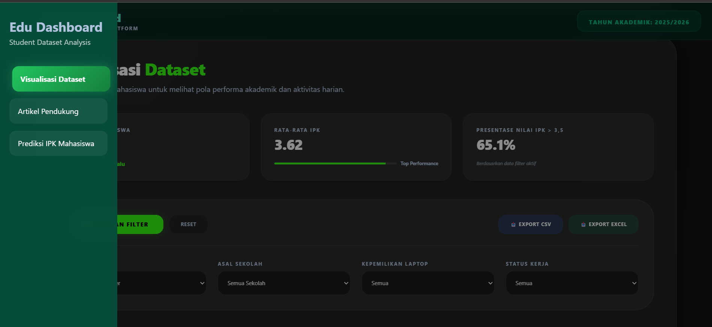
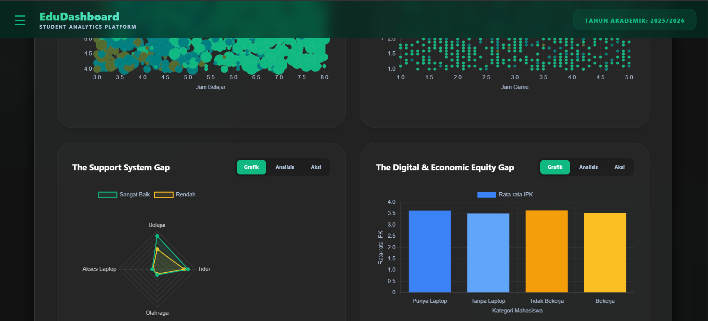
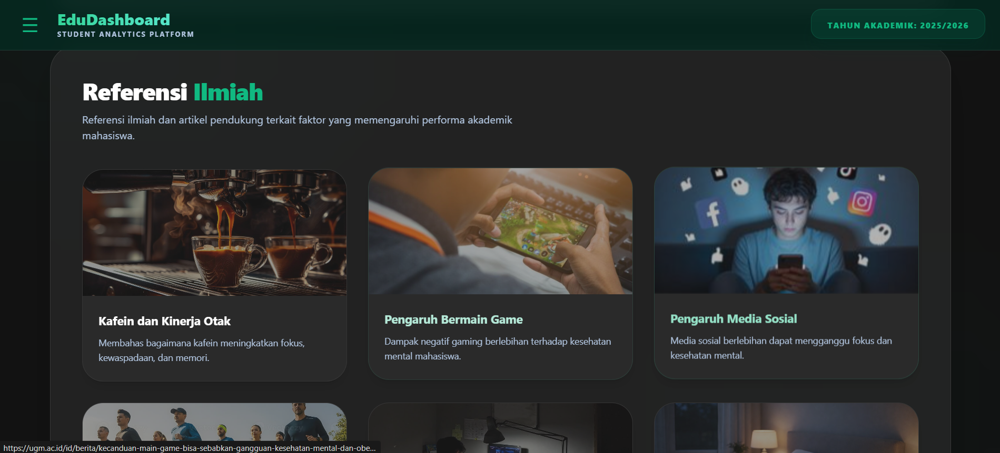
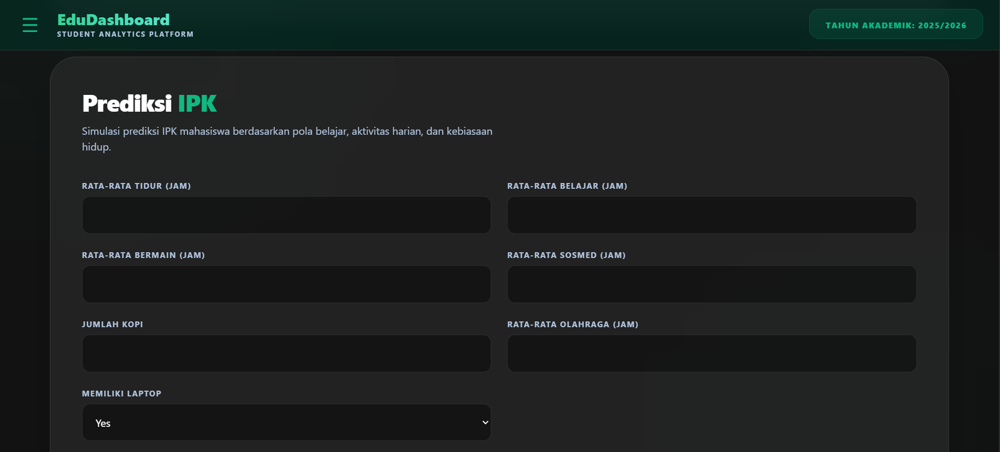
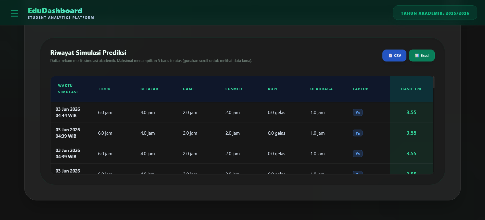

# EduDASH: Dashboard Analisis & Prediksi Nilai IPK 🎓📊

EduDASH adalah platform dashboard berbasis web menggunakan **Django Framework** yang dirancang untuk menganalisis pengaruh kebiasaan sehari-hari mahasiswa terhadap nilai Indeks Prestasi Kumulatif (IPK). Proyek ini mengintegrasikan pemrosesan data statistik dengan model Machine Learning untuk memberikan prediksi IPK secara interaktif.

Proyek ini dikembangkan menggunakan repositori resmi:  
🔗 [https://github.com/Rahmatbaaka/EduDASH-dashboard-analisis-nilai-ipk](https://github.com/Rahmatbaaka/EduDASH-dashboard-analisis-nilai-ipk)

---

## 🛠️ Tech Stack & Teknologi

Proyek ini dibangun menggunakan kombinasi teknologi berikut:

* **Backend Framework:**  (Python-based Web Framework)
* **Data Wrangling & Processing:**  
* **Machine Learning Deployment:**  (via `joblib`)
* **Frontend UI & Visualisasi:**   

---

## 👥 Anggota Kelompok
Berikut adalah anggota tim yang berkontribusi dalam pengembangan EduDASH:
* **[Rahmat Hidayat]** - [25051204070] ([@RahmatbaakaGithub](https://github.com/Rahmatbaaka))
* **[Dhany Erlangga]** - [25051204192] ([@DhanyErlangga192](https://github.com/DhanyErlangga192))
* **[Moaadh Ghamdan]** - [25051204253] ([@25051204253-MOAADH](https://github.com/25051204253-MOAADH))
* **[Rifqi ILham Rizqullah]** - [25051204209] ([@Rifqicode21](https://github.com/Rifqicode21))

---

## ✨ Fitur Utama
Aplikasi EduDASH kini menyediakan 4 menu utama dengan fungsionalitas yang lebih dinamis:

### 1. Menu Insight
Menyajikan visualisasi data yang komprehensif menggunakan **Chart.js**. Menu ini didukung oleh 7 grafik analisis:
* **The Hustle vs Health Balance (Bubble):** Memetakan hubungan antara jam belajar, jam tidur, dan konsumsi kopi terhadap IPK.
* **The Digital Distraction Grid (Scatter):** Menganalisis ambang batas waktu bermain game dan sosial media sebelum berdampak negatif pada nilai.
* **The Support System Gap (Radar):** Membandingkan profil kebiasaan mahasiswa ber-IPK tinggi vs rendah (Belajar, Tidur, Olahraga, Akses Laptop).
* **The Digital & Economic Equity Gap (Bar):** Visualisasi dampak kepemilikan laptop dan status bekerja terhadap stabilitas IPK.
* **Learning Efficiency Analysis (Bubble):** Meninjau sebaran efisiensi jam belajar harian mahasiswa terhadap perolehan IPK.
* **The Sleep & Academic Tipping Point (Scatter):** Mendeteksi titik kritis penurunan performa akademik akibat kurang tidur.
* **Institutional Background Performance (Bar):** Perbandingan rata-rata IPK berdasarkan latar belakang sekolah (SMA, SMK, MA).

### 2. Menu Prediksi
Menggunakan model Machine Learning (ML) sederhana dengan tingkat akurasi yang optimal (memanfaatkan file `model.joblib`). Melalui fitur interaktif berbasis form POST ini, pengguna dapat menginputkan data aktivitas harian mereka untuk mendapatkan estimasi atau prediksi nilai IPK secara instan.

### 3. Menu Artikel
Menyediakan artikel atau referensi penunjang yang memuat bukti keterkaitan secara ilmiah antara variabel aktivitas harian (seperti jam tidur, belajar, olahraga) dengan nilai IPK atau performa kognitif mahasiswa.

### 4. Menu Riwayat & Export
Menampilkan data riwayat prediksi dari database. Fitur ini mengimplementasikan **OOP Polimorfisme** untuk mengekspor data ke format **CSV** dan **Excel** secara dinamis.

---

## 🛠️ Cara Menjalankan Proyek

### Prasyarat (Prerequisites)
Pastikan perangkat Anda telah terinstal:
* Python 3.8 atau versi di atasnya
* PIP (Python Package Installer)

### Langkah Instalasi

1. **Clone Repositori**
```bash
git clone https://github.com/Rahmatbaaka/EduDASH-dashboard-analisis-nilai-ipk.git
cd EduDASH-dashboard-analisis-nilai-ipk

```
2. **Buat dan Aktifkan Virtual Environment**
* **Windows:**
```bash
python -m venv venv
venv\Scripts\activate

```
* **macOS/Linux:**
```bash
python3 -m venv venv
source venv/bin/activate

```
3. **Instal Dependency**
Pastikan library utama seperti `django`, `pandas`, dan `joblib` terinstal melalui perintah:
```bash
pip install django pandas joblib openpyxl

```

4. **Struktur Data Keamanan Aplikasi**
Pastikan file dataset dan model buatan kelompok Anda diletakkan pada direktori berikut:
* Dataset: `dashboard/data/dataset_ipk.csv`
* ML Model: `dashboard/models/model.joblib`


5. **Jalankan Server Django**
```bash
python manage.py runserver

```


6. Buka browser dan akses dashboard melalui URL: `http://127.0.0.1:8000/`

---

## 🧩 Penjelasan Implementasi OOP (Object-Oriented Programming)

Proyek EduDASH menerapkan pilar-pilar utama Pemrograman Berorientasi Objek secara eksplisit menggunakan bahasa Python pada sisi backend (arsitektur layanan data dan visualisasi):

### 1. Abstraction (Abstraksi)

Abstraksi menyembunyikan detail teknis yang kompleks dan hanya mengekspos fungsionalitas utama melalui kontrak kelas.
* **Implementasi:** Menggunakan kelas abstrak `BasePredictionModel` dan `BaseExporter` (via modul `abc`). Kami menetapkan metode wajib seperti `@abstractmethod predict()` dan `export_data()`. Hal ini menjamin bahwa setiap komponen baru (model atau eksportir) memiliki standar fungsi yang sama tanpa harus mengekspos logika internalnya ke lapisan view.

### 2. Inheritance (Pewarisan)

Pewarisan memungkinkan penggunaan kembali kode dan pembentukan hierarki objek yang logis.
* **Implementasi:** Kelas operasional seperti `AcademicPerformanceModel` mewarisi sifat dari `BasePredictionModel`. Demikian juga, kelas `CSVHistoryExporter` dan `ExcelHistoryExporter` mewarisi `BaseExporter`. Dengan teknik ini, kita tidak perlu menulis ulang logika pemuatan data dasar berulang kali di setiap kelas format ekspor.

### 3. Encapsulation (Pengkapsulan)

Pengkapsulan melindungi integritas data dengan membatasi akses langsung ke atribut internal objek.
* **Implementasi:** Kami menggunakan atribut *private* dengan awalan *double underscore* (contoh: `self.__model_instance` dan `self.__dataset`). Data sensitif seperti objek model Machine Learning tidak dapat diubah secara paksa dari luar kelas (seperti dari file `views.py`), melainkan harus melalui metode publik yang valid seperti `predict()`.

### 4. Polymorphism (Polimorfisme)

Polimorfisme memungkinkan satu antarmuka tunggal untuk menangani berbagai bentuk implementasi yang berbeda.
* **Implementasi:** Diterapkan secara nyata pada sistem ekspor data. Meskipun `views.py` hanya memanggil satu perintah yang sama yaitu `.export_data()`, sistem akan menghasilkan output yang berbeda (CSV atau Excel) tergantung pada jenis objek yang sedang diinstansiasi. Ini memberikan fleksibilitas tinggi jika ingin menambah format ekspor baru di masa depan.

### 5. Single Responsibility Principle (SRP)
Kami memisahkan logika pemrosesan data visual dari Django View menggunakan kelas khusus untuk menjaga kerapian kode (*clean code*).
* **Implementasi:** Kelas `DashboardDataProcessor` di `views.py` bertanggung jawab penuh mengolah `DataFrame` menjadi format JSON untuk 7 grafik berbeda. Dengan SRP, Django View hanya bertugas mengelola request/response tanpa harus tercampur dengan logika matematika yang rumit.

## Previews tampilan project

<details>
  <summary><b>Klik di sini untuk melihat screenshot lengkap</b></summary>
  <br/>
  
  1. **Header**
     
     
  2. **Sidebar**
     
     
  3. **Visualisasi**
     
     
  4. **Artikel**
     
     
  5. **Prediksi**
     
     
  6. **Riwayat**
     
     
</details>
